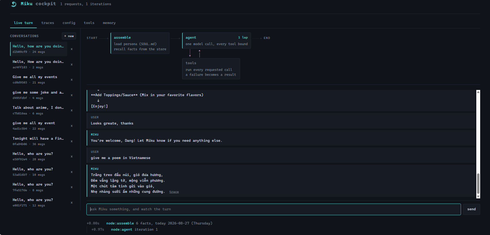

# miku-agent

Miku in your area! Miku Agent is a local first AI agent harness you actually own, including
loop, memory, eval. All in code built to stay legible as it grows.

**Phase 1 — the CLI agent.** One terminal conversation that reasons, calls tools, remembers
across conversations, leaves a readable trace, and is covered by tests. The loop is a
hand-built LangGraph `StateGraph`: three nodes and one cycle, written out rather than
summoned from a prebuilt, because the loop is the part worth reading.

**Phase 2 — best-of-N fan-out.** Ask *when* rather than *book this*, and Miku explores five
candidate slots in parallel, each from a different angle, then judges them against what it
knows about you. It is `Send`-based map-reduce in a subgraph behind a tool — so the model
decides to fan out by choosing that tool, and the main loop is still three nodes.

**Phase 3 — the cockpit.** A web gateway that watches a turn happen live: which node is
running, which tool it called, and what landed in memory — the same graph, a second window
onto it.



## Quickstart

```bash
uv sync --extra dev          # install
cp .env.example .env         # then paste your provider key into it
uv run miku                  # talk to Miku
uv run miku --thread work    # resume a named conversation
uv run miku threads          # list conversations you can resume
```

### The cockpit (web gateway)

`miku-web` is a peer of the CLI, not a subcommand of it — it needs its own extra:

```bash
uv sync --extra dev --extra web   # adds fastapi + uvicorn
uv run miku-web                   # http://127.0.0.1:8765
```

It watches a turn happen live in the browser instead of the terminal: which node is
running, which tool it called, and what landed in memory. A sidebar lists every
conversation the agent holds — including ones started in the terminal — so you can open
one, read it back, and carry it on; the conversation is in the URL, so a reload continues
it. Each entry shows how many messages it holds, because every one of them is re-sent on
every turn.

Removing a conversation deletes its messages and nothing else. Facts Miku remembered
during it are stored against you rather than against the conversation, and its traces are
keyed by turn, so both survive — the confirmation says so before it happens, and there is
no undo.

It reads through the same `open_session` entry point as the CLI and shares
`.miku/state.db`, so a fact remembered in one shows up in the other. It binds to loopback
only, has no authentication, and is built for one local user — do not expose it. That
matters more now than it did: the cockpit holds every conversation this agent has ever
had, and offers an irreversible button beside each one.

Try it: *"Remember that I dislike meetings before 9am."* Quit. Start again.
*"Book a catch-up with Alex on Saturday."* The fact is still there — it lives in
`.miku/state.db`, which is yours to open.

Then ask something with no time in it — *"find me a good time for a 1-hour design review
this week"* — and watch five branches come back out of order:

```
  > propose_slots(end_day='2026-08-30', start_day='2026-08-25', task='1-hou...)
    ... exploring 5 options in parallel
    [1] after lunch: 2026-08-25 13:30
    [3] beside existing work: 2026-08-26 10:30
    [0] early morning: 2026-08-25 09:00
    [2] quietest day: 2026-08-25 09:00
    [4] late in the window: 2026-08-30 14:00
    ... picked option 1 of 5 (judged)
miku> I recommend today, August 25th, at 09:00. Would you like me to book that?
```

It proposed; it did not book. And it did not offer you 08:00, because you told it not to.

## The map

```
      $ miku
        │
  ┌─────▼───────┐
  │ gateway/cli │  moves text; no prompts, no models, no tools, no memory
  └─────┬───────┘
        ▼
  ┌──────────── graph/ ────────────────────────────────────────────┐
  │                                                                │
  │   ┌──────────┐    ┌───────┐  tool calls?  ┌───────┐            │
  │   │ assemble │───▶│ agent │──────────────▶│ tools │            │
  │   └──────────┘    └───────┘               └───┬───┘            │
  │        ▲               ▲                      │                │
  │        │               └──────────────────────┘                │
  │   SOUL.md + facts + history        (capped at MIKU_MAX_ITERATIONS)
  └───────────────────────────────────────────────│────────────────┘
        │                          propose_slots  │
        │                                         ▼
        │        ┌──────── graph/fanout.py ─────────────────────────┐
        │        │  plan_angles ──Send x N──▶ generate (concurrent) │
        │        │                                │                 │
        │        │       format ◀── select_best ◀─┘  (LLM as judge) │
        │        └──────────────────────────────────────────────────┘
        ▼                                    ▼
  state.db: threads + facts + events   .miku/traces/<date>.jsonl
```

The fan-out is a subgraph reached through a tool, not a fourth node. That is deliberate:
choosing a tool is already how a model decides things, so "should I fan out?" needs no new
machinery — and a plain "book it Saturday at 8am" costs one request instead of eight.

| Path | What lives there |
|---|---|
| `miku/gateway/cli.py` | the terminal. Text in, text out, nothing else |
| `miku/gateway/web.py` | the cockpit's server — a peer of the CLI, needs `--extra web` |
| `miku/runtime/config.py` | every knob, read once. Nothing else touches the environment |
| `miku/runtime/providers.py` | the provider adapter — roles, capability flags, two builders |
| `miku/runtime/session.py` | one session: store, checkpointer, tools, model, tracer, graph |
| `miku/graph/build.py` | the loop, wired by hand — three nodes, one cycle |
| `miku/graph/nodes.py` | assemble context · agent · tools, plus `Deps` and `TurnContext` |
| `miku/graph/fanout.py` | the best-of-N subgraph — `Send`, a reducer, and a judge |
| `miku/runtime/budget.py` | one request allowance per turn, shared with the fan-out |
| `miku/memory/checkpointer.py` | thread state (short-term) |
| `miku/memory/store.py` | facts across threads (long-term) |
| `miku/tools/` | `create_event` · `list_events` · `remember` · `propose_slots` |
| `miku/ops/tracing.py` | JSONL sink, with redaction where it cannot be forgotten |
| `miku/ops/traceview.py` | reading a trace back as a tree, for evals and eyeballs |
| `miku/SOUL.md` | who Miku is — name and tone, nothing else |
| `evals/deterministic/` | the tests. `evals/task.py` is the one function cases drive |

## The provider adapter

Every supported provider speaks the OpenAI wire, so LangChain already handles message
formats, tool schemas, and streaming. What this repo owns instead:

- **roles, not model ids.** Callers ask for `main` / `fast` / `judge` / `embed`; the
  descriptor maps each to a concrete model.
- **capability flags.** Not theoretical — `qwen/qwen3-5-27b` refuses native structured
  output while `gemma-4-31b-it` and `openai/gpt-4o-mini` accept it. An unprobed capability
  is recorded as `unknown` and treated as unsupported.
- **two builders.** `chat_model(role)` for the graph, `judge_model()` for pydantic-evals —
  same descriptor, so the agent and the judge cannot drift onto different providers.

Adding OpenRouter, DeepSeek, or Anthropic means adding a descriptor to `PROVIDERS`. It must
never mean editing a call site.

## Memory is two things, kept apart

| | Thread state | Long-term facts |
|---|---|---|
| What | this conversation's messages | what Miku knows about you |
| Where | LangGraph checkpointer | LangGraph `Store` |
| Scope | one `thread_id` | every thread |
| Written by | the graph, automatically | the `remember` tool, only when asked |

There is still no retrieval gate: every live fact rides along in every turn, and a stored
fact's text is never rewritten — resolving one stamps `superseded_at` on the row instead.
Fine at tens of facts, wrong at thousands.

Consolidation tidies the live set — proposing `supersede` / `duplicate` / `expire` /
`merge` for a model to review, never deleting or rewriting text itself:

```bash
uv run miku consolidate            # show what it would do; writes nothing
uv run miku consolidate --apply    # actually resolve them
```

It never runs on its own — no threshold, no schedule, no tool. Someone has to type it.

## Evals

```bash
uv run pytest                      # everything
uv run pytest -k live              # the cases that call the real provider
uv run pytest evals/deterministic/test_graph.py   # the loop's contract, stubbed
```

Two halves. The **live** cases drive the real provider and skip with a stated reason when no
key is set. Everything else runs offline against a stubbed model — including the
runaway-turn case, which must terminate at the iteration cap without spending a token.

Every evaluator asserts on which tool ran and what landed in the database, never on how the
reply is worded. Small models phrase things differently on every run; stored rows do not.

## Configuration

See `.env.example`. The only required value is the provider API key.

| Variable | Default | What it does |
|---|---|---|
| `MIKU_PROVIDER` | `greennode` | which descriptor to use |
| `MIKU_MODEL_MAIN` | descriptor default | override the agent's model |
| `MIKU_MAX_ITERATIONS` | `8` | hard stop on agent laps per turn (depth) |
| `MIKU_FANOUT_BRANCHES` | `5` | candidates a fan-out explores (width) |
| `MIKU_MAX_REQUESTS_PER_TURN` | `24` | model requests per turn, fan-out included |
| `MIKU_STATE_DIR` | `.miku` | where `state.db` and `traces/` live |
| `MIKU_USER_ID` | `local` | whose facts the store holds |

## What is not here yet

No retrieval gate — every remembered fact still rides along in every turn, which is fine
at tens and wrong at thousands. No OTel, no guardrails, no semantic search over memory,
no `.ics` export. The cockpit's appearance is unverified by machine; whether the lit state
reads correctly to a person is unguarded.

No message trimming either, and this one is measured rather than assumed: a conversation's
whole history is re-sent on every turn, with no summarisation and no prompt caching, so a
long conversation is an expensive one. The message count beside each conversation is there
to make that visible. No token-by-token streaming, no renaming a conversation, and no
search across them.

No node cache either, and that one is a decision rather than a delay: it was planned for
Phase 2 and dropped on inspection, because branches are deliberately given different angles,
so no two branch inputs are ever identical and there is nothing for a cache to hit.
